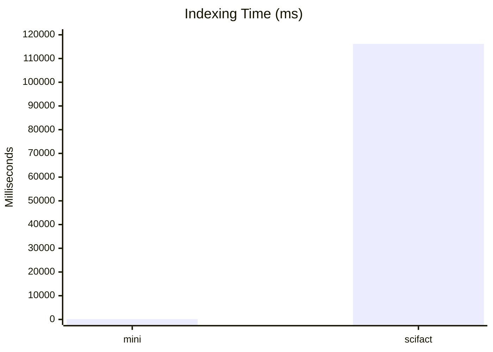
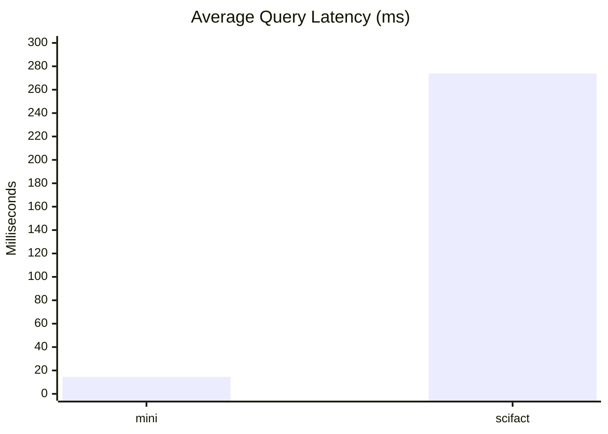
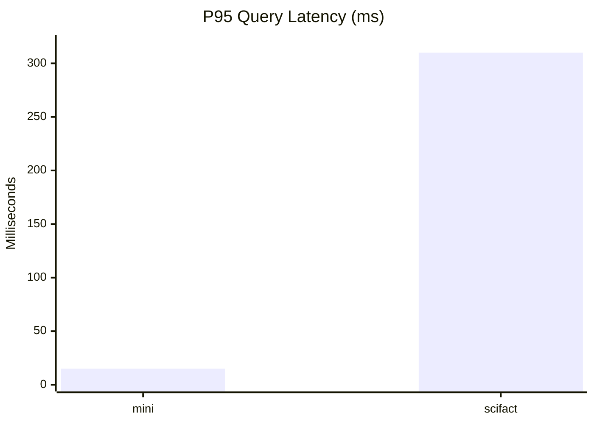

# BEIR Benchmark Report

Date: 2026-02-10

## Run Configuration

- Command: `bun run bench:beir -- --datasetDir /tmp/beir-mini-th0th --datasetName mini --projectId beir-mini-report --k 2 --maxQueries 2 --forceReindex true`
- Embedding provider: `ollama`
- Ollama base URL: `http://192.168.1.77:11434`
- Ollama model: `nomic-embed-text:latest`
- Embedding dimensions: `768`
- `.env` loading: automatic from monorepo root (`/home/joaov/projetos/th0thMCP/.env`)

## Dataset

- Dataset name: `mini` (local smoke dataset in BEIR format)
- Corpus docs: `2`
- Queries evaluated: `2`
- Qrels file: `qrels/test.tsv`
- Top-K: `2`

## Results

```json
{
  "dataset": "mini",
  "projectId": "beir-mini-report",
  "evaluatedQueries": 2,
  "k": 2,
  "metrics": {
    "Recall@2": 1,
    "nDCG@2": 1,
    "MRR@2": 1
  },
  "performance": {
    "indexingMs": 122,
    "avgQueryLatencyMs": 14.5,
    "p95QueryLatencyMs": 15
  }
}
```

## Notes

- This report is a smoke benchmark to validate the BEIR pipeline and metric computation.
- For representative quality comparisons, run with a full BEIR dataset (for example `scifact`, `nfcorpus`, or `fiqa`).

## SciFact (Real BEIR Dataset)

### Run Configuration

- Command: `bun run bench:beir -- --datasetDir /tmp/beir/scifact --datasetName scifact --projectId beir-scifact-ollama --k 10 --maxQueries 300 --forceReindex true`
- Embedding provider: `ollama`
- Ollama model: `nomic-embed-text:latest`
- Embedding dimensions: `768`
- Corpus docs: `5183`
- Queries evaluated: `300`

### Results

```json
{
  "dataset": "scifact",
  "projectId": "beir-scifact-ollama",
  "evaluatedQueries": 300,
  "k": 10,
  "metrics": {
    "Recall@10": 0.6023888888888889,
    "nDCG@10": 0.5077734173162421,
    "MRR@10": 0.48498941798941797
  },
  "performance": {
    "indexingMs": 116169,
    "avgQueryLatencyMs": 273.80333333333334,
    "p95QueryLatencyMs": 310
  }
}
```

### Quick Comparison (Mini vs SciFact)

- `mini` is a smoke test (`2 docs / 2 queries`) and naturally saturates at perfect metrics.
- `scifact` reflects realistic difficulty and is the relevant baseline for retrieval quality.
- Quality baseline established on real data: `Recall@10 ~ 0.60`, `nDCG@10 ~ 0.51`, `MRR@10 ~ 0.485`.

## Graphs

```mermaid
xychart-beta
    title "Quality Metrics (Mini vs SciFact)"
    x-axis [Recall, nDCG, MRR]
    y-axis "Score" 0 --> 1
    bar "mini" [1, 1, 1]
    bar "scifact" [0.6024, 0.5078, 0.4850]
```








